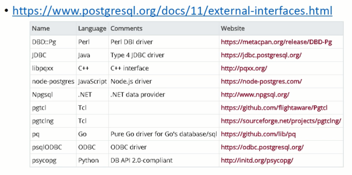

pg开发

教科书级别的数据库

PG的开源许可是类BSD许可。可以随意分发、闭源或者开源。

# 1 初识PG

## 1.1 pg的生态

**历史**

可以追溯到1973

中文官方文档：

http://www.postgres.cn/docs/10/history.html

pg wiki：

https://zh.wikipedia.org/wiki/PostgreSQL

pg roadmap：

https://www.postgresql.org/developer/roadmap/

postgresql commitfest：

https://commitfest.postgresql.org/


**PostgreSQL 社区分析 - 为什么PostgreSQL社区几乎不可能被任何一个商业公司、国家所控制？**

https://github.com/digoal/blog/blob/master/201906/20190608_02.md


**社区**

2011年成立

技术生态圈：

内核、用户、培训机构、厂商、服务商、软件开发商、高校形成`业务与利益双向驱动`的良性发展生态圈

社区组织架构：

- 轮值主席
- 常委（分管社区官网、官微、宣传、志愿者、财务）
- 分会会长
- pg大学虚拟小组
- 核心成员（阿里、腾讯、中兴、武汉大学。。。）

社区规模：

bbs、微信、QQ、微博、钉钉

社区运作：

- 公益活动：pg分会、区域会议、社区培训、技术直播、在线答疑
- 盈利模式探索
  - 流量价值,企业长期赞助
  - 社区淘宝店,售卖pg社区书籍、文化衫、笔记本等
  - 盈利回馈社区,支持社区运作


**pg特性**


**pg常见数据库部署架构**

- 单机

- 基于共享存储的HA

- 基于流复制的HA

- 读写分离

- 单元化

- 多主部署（`multi-master`）
  - xDB：https://github.com/digoal/blog/blob/master/201902/20190203_01.md
  - https://github.com/digoal/blog/blob/master/201811/20181119_01.md

- 基于物理流复制的强一致多副本（兼具可用性、可靠性）
- 级联复制
- Sharding
  - https://github.com/digoal/blog/blob/master/201808/20180824_02.md


**pg备份**

- 全量+归档增量备份
- 全量+块级增量备份
  - https://github.com/digoal/blog/blob/master/201608/20160826_01.md
- 快照+归档增量备份
  - https://github.com/digoal/blog/blob/master/201608/20160823_05.md
- 时间点恢复
  - https://github.com/digoal/blog/blob/master/201901/20190120_03.md
- 容灾
  - https://github.com/digoal/blog/blob/master/201901/20190128_02.md
- 链路加密
- 数据存储加密
- 数据类型加密
- 数据库ACL
- SQL防火墙
- 外部数据库（冷热分离）
- 跨库访问
- 同构、异构增量同步


**客户群**

xxxx


**应用场景**

- 企业级核心应用,代替oracle

- IoT

- GIS地理信息,时空场景

- 实时BI（实时任意维度数据搜索、透视、复杂分析）

- 混合负载业务（既有AP又有TP）

- 图像搜索

- 向量相似查询

- SQL流计算

- 搜索（全文检索、模糊检索、任意字段组合检索、相似搜索、正则搜索）

- 冷热数据分离（oss_fdw、file_fdw。。。）
  - https://www.postgresql.org/docs/current/postgres-fdw.html
  - https://wiki.postgresql.org/wiki/Foreign_data_wrappers

- 沙箱
  - https://github.com/digoal/blog/blob/master/201805/20180524_02.md

- 如来神掌
  - https://github.com/digoal/blog/blob/master/201706/20170601_02.md


**生态**

pg系数据库：

https://wiki.postgresql.org/wiki/PostgreSQL_derived_databases


**pg和其他商用数据库的差异化**

xxxx


**pg学习资料**

文档：

https://github.com/digoal/blog/blob/master/README.md

Oracle DBA PG学习手册：

https://github.com/digoal/blog/blob/master/201804/20180425_01.md

如来神掌,pg大量应用场景实践：

https://github.com/digoal/blog/blob/master/201706/20170601_02.md

原理、开发、管理、实践：

https://github.com/digoal/blog/blob/master/201801/20180121_01.md

沙箱：

https://github.com/digoal/blog/blob/master/201805/20180524_02.md


**交流圈子**

xxxx

 **架构独特性**

PG采用了开放接口的设计：

- type,operator,index
- storage,language,fdw
- custom,scan,sample,hook等

基于PG开发接口扩展的产品或插件：

- 基于PG的图数据库agensgraph,edgedb
- 流数据库pipelinedb
- GIS PostGIS,pgrouting,pgpointcloud
- 时序数据库 timescaledb
- 推荐数据库 recdb
- 搜索引擎 Yahoo! Everest
- MPP greenplum,redshift,asterdata
- 机器学习 madlib
- 图像识别 imgsmlr
- 分词 zhparser,pg_jieba
- 分布式数据库 citus,pg-xI,华为Gauss,antdb
- Oracle兼容 edb
- 文档数据库 torodb


pg插件仓库：

https://pgxn.org/

Gis插件：

https://postgis.net/


**技术趋势**

1、pg是多模数据库,因为它的开放性,可以随意扩展。例如前面提到的诸多插件,使得PG是目前最强大的多模数据库。

2、内置并行计算（36种并行计算场景（几乎涵盖所有ap sql）,平均提速20倍以上）。

3、支持存储引擎扩展（12,zheap,zedstore）。

4、对芯片友好,如ARM芯片的支持。

以上4点满足市场的既要又要还要的需求：

既要SQL通用性,又要NOSQL扩展性,还要多模开发便捷性。

既要OLTP又要OLAP。


PG OLAP能力

PostgreSQL 11 并行计算使用场景、性能提升倍数：

https://github.com/digoal/blog/blob/master/201903/20190318_05.md


## 1.2 安装

https://github.com/digoal/blog/blob/master/201901/20190105_01.md

https://github.com/digoal/blog/blob/master/201611/20161121_01.md

熟悉pg在linux的安装


**linux内核配置**

/etc/sysctl.conf

https://github.com/digoal/blog/blob/master/201608/20160803_01.md

注意 sysctl.d优先级

```shell
# 最多文件打开数
fs.aio-max-nr=1048576
fs.file-max=76724600

# 可选：kernel.core_pattern=/data01/corefiles/core_%e_%u_%t_%s.%p
# /data01/corefiles 事先建好,权限777,如果是软链接,对应的目录修改为777

kernel.sem=4096 2147483647 2147483646 512000
# 信号量,ipcs -l或-u查看,每16个进程一组,每组信号量需要17个信号量。

kernel.shmall=107374182
# 所有共享内存段相加大小限制（建议内存的80％）,单位为页。

kernel.shmmax=274877906944
# 最大单个共享内存段大小（建议为内存一半）,＞9.2的版本已大幅降低共享内存的使用,单位为字节。

kernel.shmmni=819200
# 一共能生成多少共享内存段,每个PG数据库集群至少2个共享内存段

# 网络相关配置
net.core.netdev_max_backlog=10000
net.core.rmem_default=262144
# The default setting of the socket receive buffer in bytes. 
net.core.rmem_max=4194304
# The maximum receive socket buffer size in bytes 
net.core.wmem_default=262144
# The default setting (in bytes) of the socket send buffer. 
net.core.wmem_max=4194304
# The maximum send socket buffer size in bytes. 
net.core.somaxconn=4096
net.ipv4.tcp_max_syn_backlog=4096 
net.ipv4.tcp_keepalive_intvl=20 
net.ipv4.tcp_keepalive_probes=3 
net.ipv4.tcp_keepalive_time=60
net.ipv4.tcp_mem=8388608 12582912 16777216 
net.ipv4.tcp_fin_timeout=5
net.ipv4.tcp_synack_retries=2 
net.ipv4.tcp_syncookies=1

# 开启SYN Cookies。当出现SYN等待队列溢出时,启用cookie来处理,可防范少量的SYN攻击
net.ipv4.tcp_timestamps=1
# 减少time＿wait
net.ipv4.tcp_tw_recycle=0
# 如果＝1则开启TCP连接中TIME—WAIT套接字的快速回收,但是NAT环境可能导致连接失败,建议服务端关闭它
net.ipv4.tcp_tw_reuse=1
# 开启重用。允许将TIME—WAIT套接字重新用于新的TCP连接
net.ipv4.tcp_max_tw_buckets=262144
net.ipv4.tcp_rmem=8192 87380 16777216 
net.ipv4.tcp_wmem=8192 65536 16777216 
# iptables相关
net.nf_conntrack_maxy 1200000
net.netfilter.nf_conntrack_max=1200000 

vm.dirty_background_bytes=409600000
# 系统脏页到达这个值,系统后台刷脏页调度进程pdflush（或其他）自动将（dirty＿expire＿centisecs／100）秒前的脏页刷到磁盘
# 默认为10％,大内存机器建议调整为直接指定多少字节

vm.dirty_expire_centisecs=3000
# 比这个值老的脏页,将被刷到磁盘。3000表示30秒。

vm.dirty_ratio=95
# 如果系统进程刷脏页太慢,使得系统脏页超过内存95％时,则用户进程如果有写磁盘的操作（如fsync,fdatasync等调用）,则需要主动把系统脏页刷出。
# 有效防止用户进程刷脏页,在单机多实例,并且使用CGROUP限制单实例IOPS的情况下非常有效。

vm.dirty_writeback_centisecs=100
# pdflush（或其他）后台刷脏页进程的唤醒间隔,100表示1秒。

vm.swappiness=0
# 不使用交换分区 

vm.mmap_min_addr=65536
vm.overcommit_memory=0
# 在分配内存时,允许少量over malloc,如果设置为1,则认为总是有足够的内存,内存较少的测试环境可以使用1.

vm.overcommit_ratio=90
#当overcommit_memory=2时,用于参与计算允许指派的内存大小。

vm.swappiness=0
# 关闭交换分区

vm.zone_reclaim_mode=0
# 禁用 numa, 或者在vmlinux中禁止.

net.ipv4.ip_local_port_range=40000 65535
# 本地自动分配的TCP,UDP端口号范围

fs.nr_open=20480000
# 单个进程允许打开的文件句柄上限

# 以下参数请注意
# wm.extra_free_kbytes=4096000
# vm.min_free_kbytes=2097152 # vm.min_free_kbytes建议每32G内存分配1G vm.min_free_kbytes
# 如果是小内存机器,以上两个值不建议设置

# vm.nr_hugepages=66536
# 建议sharedbuffer设置超过32GB时使用大页,页大小/proc/meminfoHugepagesize
# vm.lowmem_reserve_ratio=111
# 对于内存大于64G时,建议设置,否则建议默认值25625632
```


**linux资源限制**

```shell
# 注意limits.d优先级
# ngfile超过1048576的话,一定要先将sysctl的fs.nr_open设置为更大的值,并生效后才能继续设置nofile,

* soft nofile 1024000
* hard nofile 1024000
* soft nproc unlimited 
* hard nproc unlimited
* soft core unlimited
* hard core unlimited
* soft memlock unlimited
* hard memlock unlimited


```

**大页配置**

https://github.com/digoal/blog/blob/master/201803/20180325_02.md

https://github.com/digoal/blog/blob/master/201601/20160111_01.md


为什么要使用hugepage？

- OOM
- Partition table,Relcache
- Process model,Shared buffer touch,hash table
  - https://commitfest.postgresql.org/22/1695

```shell
评估Hugepage设置多大？

1、评估PG启动需要多少共享内存,先使用非大页启动
配置postgresgl.conf
huge_pages= off
启动数据库,从postmaster.pid中获取数据库启动需要多少内存。
获得PID
$ Shead-1SPGDATA/postmasterpid
4170
计算数据库启动用了多少内存,指定进程ID
$ Spmap4170 | awk '/rw-s/ && /zero/ {print $2}'
6490428K

2、计算需要多少HUGEPAGE（hugepage页大小）
$ grep ^Hugepagesize /proc/meminfo
Hugepagesize：2048kB
计算需要多少HUGEPAGE
6490428/2048 gives approximately 3169.154
soin this example weneed atleast3170 huge pages
which we can set with:

配置
3、根据计算好的HUGEPAGE数分配HUGEPAGE
$ sysctl -w vm.nr_hugepages=3170
Alarger setting would be appropriate if other programs on the machine also need hugepages.

Don't forget to add this setting to /etc/sysctl.conf so that it will be reapplied lafter reboots.

$ vi/etc/sysctl.conf
vm.nr_hugepages=3170

4、配置postgresql.conf,让数据库使用hugepage。
huge_pages=on # 或者try
shared_buffers=8GB # 使用8G内存
5、操作系统（可选,关闭透明大页）
配置grub.conf,加入如下,重启系统
numa=off
transparent_hugepage=never
或
在/etc/rc.local中加入下面的几行,然后重启操作系统：
if test -f /sys/kernel/mm/transparent_hugepage/enabled;then
	echo never > /sys/kernel/mm/transparent_hugepage/enabled
fi
if test -f /sys/kernel/mm/transparent_hugepage/defrag;then
	echo never > /sys/kernel/mm/transparent_hugepage/defrag
fi

6、启动数据库
$ pg_ctl start
7、查看是否已使用大页。
获得PID
$ head -l $PGDATA/postmaster.pid
4170

计算数据库启动用了多少内存,指定进程ID
$ pmap 4170 | awk '/rw-s/ && /zero/ {print $2}'
没有返回,说明使用了hugepage.
```

**存储卷配置**

为什么要卷管理？

- 大表空间（PG表空间与目录对应,目录与文件系统对应）
- 单个块设备空间不够
- 多个块设备组成一个大文件系统

如何进行卷管理

- https://github.com/digoal/blog/blob/master/201809/20180919_01.md
- Lvm
- Zfs


**文件系统条带、INODE、MOUNT配置**

```shell
ERROR:  could not create file "base/16392/166637613"：No space left on device

digoal=# dolanguage plpgsql$
declare
begin
fori in 1..1000 1oop
execute 'create table test'||i||'(id int primary key, c1 int unique, c2 int unique)’;
end loop;
end;
$$;

ERROR: 53100: could not create file "base/16392/166691646": NO space left on device
CONTEXT: SOL statement "create table test43(id int primary key, c1 int unique, c2 int unique)"
PL/pgSQL function inline_code_block line 5 at EXECUTE statement
LOCATION: mdcreate, md.c:304
```

```shell
Inode,条带,mount
每8K分配一个INODE（如果文件的平均大小为8K的话）

创建ext4文件系统,配置条带（PG采用8K blocksize）
$ mkfs.ext4 /dev/mapper/vgdata01-lv01 -m 0 -O extent,uninit_bg -E
lazy_itable_init=1,stride=2,stripe_width=32 -i 8192 4096 -T largefile -L lvO1
$ mkfs.ext4 /dev/mapper/vgdata01-lv02 -m 0 -O extent,uninit_bg -E
lazy_itable_init=1,stride=2,stripewidth=32 -i 8192 -b 4096 -T largefile -L lv02
$ mkfs.ext4 /dev/mapper/vgdata01-lv03 -m 0 -O extent,uninit_bg -E
lazy_itable_init=1,stride=2,stripe_width=32 -i 8192-b 4096 -T largefile -L lv03
```

```shell
配置挂载
$ vi /etc/fstab
LABEL=lvO1 /data01 ext4 defaults,noatime,nodiratime,nodelalloc,barrier=0,data=writeback 0 0
LABEL=lvO2 /data02 ext4 defaults,noatime,nodiratime,nodelalloc,barrier=0,data=writeback 0 0
LABEL=lV03 /data03 ext4 defaults,noatime,nodiratime,nodelalloc,barrier=0,data=writeback 0 0

mkdir /data01
mkdir /data02
mkdir /data03

mount -a
```

**cgroup资源隔离**

https://github.com/digoal/blog/blob/master/201701/20170111_02.md
https://github.com/digoal/blog/blob/master/201606/20160611_01.md
https://github.com/digoal/blog/blob/master/201606/20160613_01.md
https://github.com/digoal/blog/blob/master/201602/20160215_01.md

- Cpu隔离
- Memory隔离
- Iops RW隔离
- Bps RW隔离


**编译安装**

https://github.com/digoal/blog/blob/master/201611/20161121_01.md


**RPM安装**

https://github.com/digoal/blog/blob/master/201710/20171018_01.md


```shell
# 一些环境变量配置
export PS1="$USER@`/bin/hostname -s`->"
export PGPORT=8001
export PGDATA=/datao1/digoal/pg_rootSPGPORT
export LANG=en_US.utf8
export PGHOME=/home/digoal/pgsql11.1
export LD_LIBRARY_PATH=$PGHOME/lib;/lib64;/usr/lib64;/usr/local/lib64;/lib;/usr/lib;/usr/local/lib;$LD_LIBRARY_PATH
export DATE=`date+"%Y%m%d%H%M"`
export PATH=$PGHOME/bin;$PATH;
export MANPATH=$PGHOME/share/man;$MANPATH
export PGHOST=$PGDATA
export PGUSER=postgres
export PGDATABASE=postgres
alias rm='rm -i'
alias ll='ls -lh'
unalias vi
```


**插件安装**

https://pgxn.org/

```shell
git安装：
wget http://api.pgxn.org/dist/orafce/3.7.2/orafce-3.7.2.zip
unzip orafce-3.7.2.zip
cd orafce-3.7.2/
export PATH=/home/digoal/pgsql11.1/bin:$PATH
which pg_config
USE_PGXS=1 make
USE_PGXS=1 make install


psql
psql(11.1）
Type "help” for help.
postgres=# create extension orafce；
CREATEEXTENSION

postgres=# \dx+ orafce
Objects in extension "orafce'
Object description
-------------------------------------------------------------
cast from bigint to nvarchar2
cast from bigint to varchar2
cast from character to nvarchar2
cast from character to varchar2
```


**大版本升级-二进制校验**

https://www.postgresql.org/docs/current/pgupgrade.html

```shell
$ pg_upgrade -b $PGHOME/bin -B $PGHOME/bin -c -d $PGDATA -D /data01/digoal/pg_root8000
PerformingConsistency Checks
---------------------------
Checking cluster Versions                   ok
Checking database user is the install user    ok
Checking database connection settings      ok
Checking for prepared transactions			ok
Checking for reg* data types in user tables	ok
Checking for contrib/isn with bigint-passing mismatch	ok
Checking for presence of required libraries	ok
Checking database user is the install user	ok
Checking for prepared transactions	ok
*Clusters are compatible*

# 显示pg信息
$ pg_controldata
```

## 1.3 实例初始化、基本配置

熟悉数据库初始化、参数、防火墙、物理架构、逻辑结构、权限体系。


**初始化数据库集群**

```shell
规划数据目录：
- datafile ($PGDATA）

规划表空间（可选）:
- 数据表空间（index scan 离散IO（RW）,seq scan 顺序IO）
- 索引表空间（离散IO（RW））

规划REDO目录（可选）
- 顺序IO
- pg_test_fsync

规划日志目录（可选）
- log,顺序1O

规划临时对象表空间目录（可选）
- 临时表、索引,排序临时文件等 -temp_tablespaces

规划归档目录（可选）
规划备份目录（可选）
initdb

```

```shell
initdb [OPTION] ... [DATADIR]
Options:
[-D,--pgdata=DATADIR 	location for this database cluster
-E	--encoding=ENODING 	 setdefault encoding for new databases
--locale=LOCALE			 set default locale for new databases
--lc-collate=,--lc-ctype=,--lc-messages=LOCALE
--lc-monetary=,--lc-numeric=,--lc-time=LOCALE
set default locale in the respective category for new databases(default taken for new environment）
--no-locale equivalent --to-locale=C
-U,--username=NAME			database superuser name
-X,--waldir=WALDIR			location for the write-ahead log directory
--wal-segsize=SIZE			size of WAL segments,in megabytes
-k,--data-checksums		    use data page checksums
-s,--show					show internal settings
```

```shell
mkdir /data01/digoal/pg_root8000
chown -R digoal:digoal /data01/digoal
export PGDATA=/data01/digoal/pg_root8000
mkdir /data02/digoal/pg_wal8000  # redo存储的目录
chownn -R digoal:digoal /data02/digoal/pg_wal8000
initdb -D $PGDATA -U postgres -E UTF8 --lc-collate=C --lc-ctype=en_US.UTF8 -X /data02/digoal/pg_wal8000 -k

# 启动
pg_ctl start -D $PGDATA -o "-c work_mem='3MB'" -o "-c XXX='xX'" ...
# 关闭
pg_ctl stop -m fast -D $PGDATA
pg ctl stop -m immediate -D $PGDATA
```

```shell
单用户模式
什么时候要用单用户？
https://github.com/digoal/blog/blob/master/201012/20101210_01.md
$ postgres --single
Options for Single-User Mode
	The following options only apply to the single-user model (see SINGLE-USER MODE).
	--single
		Selects the single-user mode.This mlist be the first argument on the command line
	database
		Specifies the name of the database to be accessed.This must be the last argument on the command line. if it is omitted it defaults to the user name.
	-E
		echo all commands to standard output before executing them
	-j
		Use semicolon followed by two newlines,rather than just newline,as the command entry terminator
	-r filename
	Send all server log output to filename. This option is only honored when supplied as a command-line option.
```

```shell
# 自启动
chmod +x /etc/rc.d/rc.loca
vi /etc/rc.local
if test -f /sys/kernel/mm/transparent hugepage/enabled; then
	echo never > /sys/kernel/mm/transparent_hugepage/enabled
fi
su - postgres -c "pg_ctl start"
```


**pg参数介绍、优化**

PG11参数讲解、优化模板
https://github.com/digoal/blog/blob/master/201812/20181203_01.md

参数优先级
https://github.com/digoal/blog/blob/master/201901/20190130_03.md


**数据库防火墙介绍与配置**

```shell
iptables（略）

pg_hba.conf
# METHOD can be trust”,”reject,“md5”,“password",“scram-sha-256",
# “g5s",“sspi",“ident”, "peer”, "pam”,“ldap", "radius” or “cert".

# Note that "password” sends passords in clear text；"md5” or
# “scram-sha-256” are preferred since they send encrypted passwords。

# TYPE DATABASE USER ADDRESS METHOD
# “local“ is for Unix domain socket connections only
local  all      all 		trust
# IPv4 local connections
host   all     	all  127.0.0.1/32 	trust
# IPv6 local connections
host   all		all	  ::1/128		trust
# Allow replication connections from localhost,by a user with the
# replication privilege
local replication all 	trust
host replication  all 127.0.0.1/32	trust
host replication  all ::1/128	    trust
host all	all   0.0.0.0/0		md5
host replication all 0.0.0.0/0  mds
```

**数据库物理架构**

```shell
数据库进程结构：
postmaster		所有数据库进程的主进程（负责监听和fork子进程）
startup     	主要用于数据库恢复的进程
syslogger		记录系统口志
pgstat			收集统计信息
pgarch			如果开启了归档,那么postmaster会fork一个归档进程
checkpointer	负责检查点的进程
bgwriter		负责把shared bufer中的脏数据写入磁盘的进程
autovacuumlanucher	负责回收垃圾数据的进程,如果开启了autovacuum的话,那么postmaster会fork这个进程
autovacuumworker	负责回收垃圾数据的worker进程,是lanucher进程fork出来的
bgworker		分为很多种worker,例如logical replication worker launcher,parallel worker, replication worker等
wal sender		逻辑复制、流式物理复制的WAL发送进程
wal receiver	逻辑复制、流式物理复制的WAL接收进程
vorkprocess		工作进程,动态fork,例如并行计算的进程
```


**数据库逻辑结构**

https://github.com/digoal/blog/blob/master/201605/20160510_01.md


**数据库权限体系**


**数据库驱动**



**连接数据库**

```shell
CLI
	- psql
GUI
	- pgadmin
	- navicat
```

```shell
psql用法
\?
\h <command>
tab 自动补齐command
```


使用流复制协议连接数据库

https://www.postgresql.org/docs/11/protocol-replication.htm

```shell
$ psql "replication=1” -h HOST -p PORT -U USER DBNAME
pg_basebackup	使用流协议备份
pg_receivewal	使用流协议实时归档
pg_recvlogical	使用流协议实时订阅
```


**SSL链路**

https://github.com/digoal/blog/blob/master/201305/2013052_01.md

```shell
数据传输链路加密
https://github.com/digoal/blog/blob/master/201305/2013052_01.md

编译PG  
--with-openssl

生成cert, key对
$ openssl

postgresql.conf
ssl=on #(change requires restart）
SsL_ciphers='DEFAULT:!LOW:!EXP:!MD5:@STRENGTH' # allowed SsL ciphers
				#（change requires restart）
ssl_renegotiation_limit=512MB # amount of data between renegotiations
ssl_cert_file='server.crt #（change requires restart）
ssL_key_file='server.key'

pg_hba.conf
#host DATABASE USER ADDRESS METHOD [OPTIONSJ
#hostssl DATABASE USER ADDRESS METHOD [OPTIONS]
#hostnossl DATABASE USER ADDRESS METHOD [OPTIONS

client
# 强制使用或不使用ssl的方法
psql "sslmodel=require"
psql "sslmodel=disable"
```

```shell
检验是否使用SSL连接
postgres=# create extension sslinfo;
CREATE EXTENSION
digoal=# select ssl_is_used(）
ssl_is_used
----------
t
（1 row）
digoal=# select ssl_cipher()
ssl_cipher
------------
DHE-RSA-AES256-SHA
（1 row）
digoal=# select ssl_version()
ssl version
---------
TLSv1
（1 row）
```


## 1.4 应用开发者指南

1、掌握数据库的使用,数据类型、操作符、对象类型内置函数,高级SQL用法、事务隔离级别和锁。
2、掌握触发器,事件触发器的使用。
3、掌握分区表的使用,异步消息的使用。


### 1.4.1 基本sql语句用法

http://www.postgresgltutorial.com/
https://www.postgresql.org/docs/11/sql-commands.htm
https://www.postgresql.org/docs/11/tutorial-sql.htm


SQL保留|关键字(keywrods)大全

https://github.com/digoal/blog/blob/master/201710/20171024_06.md


**建表**

xxx

**select into &create table as**

xxx

**插入**

xxxx

**更新**

xxx

**删除**

```sql
delete update limit
update tbl set XX=Xx where ctid = any(array(
select ctid from tbl where xx limit xx xxor update
));
delete from tbl where ctid = any(array(
select ctid from tbl where xx limit xx for update
));
```

**查询**

xxxx

**批量DML**

https://github.com/digoal/blog/blob/master/201704/20170424_05.md

```sql
https://github.com/digoal/blog/blob/master/201704/20170424_05.md

insert into xx values (..),(..),(..),(..);
copy XX from stdin;
copy Xx from 'file';

# 注意：update\delete 批量操做,join不是一一对应的,更新目标可能会随机匹配。
update t set info=tl.info, crt_time=t1.crt_time from t1,t2 where(t.id=t1.id） and
t1.id=t2.id;
                                                                 
update tbl_1 set.relname=tmp.rel from(values(1),(2)) tmp (rel) where
tmp.rel=tbl_l.reltype;
                                                                 
delete from t using t1 where t.id=t1.id;
delete from tbl_1 using (values (1), (2)) tmp (rel) where tmp.rel=tbl_1.reltype;
```


**DB端COPY**

**客户端COPY**

https://github.com/digoal/blog/blob/master/201805/20180516_03.md
https://github.com/digoal/blog/blob/master/201805/20180510_01.md

```shell
DB端copy
copy tbl to 'file';
copy (SQL) to 'file';
copy tbl from 'file';

客户端copy
copy tbl from stdin;
copy (SQL) to stdout;
copy tbl to stdout;
psql (\copy to|from); -- copy协议
```


**排序**

**OFFSET LIMIT**

论count与offset使用不当的罪名 和 分页的优化

https://github.com/digoal/blog/blob/master/201605/20160506_01.md


```sql
# 注意创建索引的时候是否指定了nulls first or nulls last
select * from tbl_1 order by relname nulls first;
select * from tbl_1 order by relname nulls last;

select * from tbl_1 order by relname;
select * from tbl_1 order by relname limit 10 offset 10;
select * from tbl_1 order by relname:text collate "C”;
```

```sql
为什么不走索引?
1、索引顺序,ORDER BY是否匹配？
2、where条件是否为stable,immutable表达式或常量？
3、索引AM是否支持order by？
4、操作符是否支持ORDER BY？

select * from pg_operator where oid in (select amopopr from pg_amop where amopsortfamily <> 0);
```

pg函数有3种状态：volatile、stable、immutable

```sql
为什么offset越大越慢？
1、OFFSET到目标行之前,处理了多少行？
create table t (id int primary key, info text, crt_time timestamp);
insert into t select
generate_series(1,10000000), 'abc', clock_timestamp();

select * from t where info='abc' limit 10 offset O;
select * from t where info='abc' limit 10 offset 100000;

为什么offset位移后突然变慢？
1、扫描方法
2、OFFSET位移到目标行前处理了多少行

create table test (id int, info text, crt_time timestamp);
insert into test select 1, 'test', clock_timestamp() from generate_series(1,100);
insert into test select 2, 'test', clock_timestamp() from generate_series(1,10000000);
insert into test select 1, 'test', clock_timestamp() from generate_series(1,100);

select * from test where id=1 limit 100 offset 0;
select * from test where id=1 limit 1 offset 101;
```


**聚合、解聚合**

```sql
select string_agg(relname, ',' order by XX) from tbl_1;
select g,avg(c1) from tbl group by g;
postgres=# select unnest(array[1,2,3]);
unnest
---------
1
2
3
（3 rows）
```

regex_split_to_table


**DISTINCT**

https://github.com/digoal/blog/blob/master/201710/20171017_02.md
https://github.com/digoal/blog/blob/master/201903/20190317_01.md

```sql
select distinct relnamerelnamespace from pg_class;
SELECT id COUNT_DISTINCT(val) FROM test_table GROUP BY 1;
select count(distinct (relname, relnamespace)) from pg_class;
select distinct on (c3) c2,c3 from tbl;
```


**INNER|OUTER JOIN**


**交并差**

union -- 去重
union all
except -- 去重
except all
intersect -- 去重
intersect all


**ANY|SOME|ALL**

```sql
select from where xX = any(array(sql);
select from where XX= any(array[val1, ...., valn]);
select from where XX= some(array(sql));
select from where XX = some(array[val1, ..., valn]);
select from where Xx = all(array(sql));
select from where xx = all(array[val1, ...., valn]);
```


**UPSERT**

```sql
insert into t4 values (1, 'test', now()) on conflict(id) do update set
info = excluded.info, crt_time = excluded.crt_time;
insert into t4 values (1, 'test', now()) on conflict (id) do nothing;
```


**DELETE|UPDATE JOIN**

```SQL
update t set info = t1.info, crt_time = t1.crt_time from t1, t2 where
(t.id = t1.id) and t1.id = t2.id;

update tbl_1 set relname = tmp.rel from (values (1),(2)) tmp (rel) where
tmp.rel = tbl_1.reltype;

delete from t using t1 where t.id = t1.id;

delete from tbl_1 using(values (1),(2)) tmp (rel) where
tmp.rel = tbl_1.reltype;
```


**游标**

```sql
postgres=# begin
BEGIN
postgres=# declare cur1 cursor for select * from t4;
DECLARE CURSOR
postgres=# fetch 5 from cur1;
id | info | crt_time
-------------------------
1  | test | 2019-02-0922:23:16.821822
（1 row）
postgres=# close cur1;
CLOSE CURSOR

为什么要用游标？
翻页优化
```


**序列**

```sql
postgres=# create sequence seq1 cache 10;
postgres=# select * from pg_sequence_parameters('seq1'::regclass);
start_value | minimum_value | maximum_value | increment |cycle_option | cache_size | data_type
----------------------------------
1 | 1 | 9223372036854775807 | 1 | f | 10 | 20

nextval(oid)
setval(oid, val)
lastval(): 最后一次nextval的返回值,每个会话一个
alter sequence

postgres=# create table tbl_321(id serial8);
postgres=# \d+ tbl_321
	Table	"public.tbl321"
Column | Type | Colation | Nullable | Default | Storage | Stats target | Description
id | bigint | not null | nextval('tbl_321_id_seq'::regclass) | plain|  |
```


**索引**

```sql
索引方法
create index idx1 on tbl using btree (col);
create index idx1 on tbl using gin (col);

btree,gin,gist,spgist,brin,bloom,hash,rum方法

表达式索引
create index idx1 on tbl using gist(st_makepoint(x, y));

条件索引
create index idx1 on tbl(col) where XXX;
```


**修改表结构**

```sql
postgres=# alter table t4 add column c1 int8 default 10;
ALTER TABLE
postgres=# alter table t4 alter column c1 type text using cl::text;
ALTER TABLE
postgres=# alter table t4 drop column c1;
ALTER TABLE
```


**DDL事务**

```sql
postgres=# begin；
BEGIN
postgres=# insert into t4 values(2);
INSERT 0 1
postgres=# alter table t4 rename to t5;
ALTER TABLE
postgres=# create table t4 (id int);
CREATE TABLE
postgres=# end;
COMMIT
```


**约束**

https://github.com/digoal/blog/blob/master/201712/20171223_02.md

```sql
约束种类与用法：
- 唯一,unique
- 非空,not null
- check,check(exp)
- 外键
排他（例如,空间不相交,地图应用,范围不相交,边界限制。）
- https://github.com/digoal/blog/blob/master/201712/20171223_02.md

CREATE TABLE reservation
(during tsrange,
EXCLUDE USING GIST (during WITH &&)
);

CREATE EXTENSION btree_gist;
CREATE TABLE room_reservation
(room text,
during tsrange,
EXCLUDE USING GIST (room WITH =, during WITH &&)
);

排他
postgres=# create table t_meeting (
roomid int, --会议室ID
who int,--谁定了这个会议室
ts tsrange,--时间范围
desc text,-会议内容描述
exclude using gist (roomid with=, ts with &&) --排他约束,同一个会议室,
不允许有时间范围交叉的记录
);

```


**条件表达式**

https://www.postgresql.org/docs/11/functions-conditional.html#FUNCTIONS-NULLIF

```sql

case when then ... else end

coalesce(v1,v2....) -- return first nonnull val
nullif(v1,v2) --V1=V2 return null else return v1
greatest(v1,v2...) -- 返回最大的
least(v1,v2..) -- 返回最小的
```


**类型转换**

```sql
cast(col as newtype)
col::newtype


```


**行号**

```sql
当前事务号
- txid_current()

当前REDO位点
- pg_current_wal_Isn()

行号
- ctid

事务中的命令号
- cmin, cmax

写入事务号（会回卷）
- xmin
删除事务号（会回卷）
- xmax
```


**窗口**

https://www.postgresql.org/docs/11/sql-expressions.html#SYNTAX-WINDOW-FUNCTIONS

```sql
窗口
一个分组的所有行
select row_number() over w1 as rn, * 
from t1_window w1 as (partition by id), w2 as (partition by id order by info);

select row_number() over (partition by id) as rn, * from t1;

帧
一个分组内的数据的额外范围限定。为一个帧（滑动窗口）
{RANGE | ROWS | GROUPS} frame_start [ frame_exclusion ]
{RANGE | ROWS | GROUPS} BETWEEN frame_start AND frame_end [ frame_exclusion ]
```


**函数调用**

从pg11开始支持存储过程,函数有返回,存储过程没有返回。

```sql
select udf(?) from tbl;
select x from tbl where udf(x);
select x from tbl where udf(x)=?;

支持嵌套调用
支持PL/PGSQL内调用
```


**SRF**

函数的一种,可以返回多行记录

SRF（returns setof ....）

```sql
postgres=# create or replace function f() returns setof int as $$
postgres=# select * from (values(1),(2)) t(id);
postgres=# $$ language sql strict;
CREATE FUNCTION
postgres=# select f();
f
----
1
2
postgres=# select generate_series(1, 3);
generate_series
------
1
2
3
(3 rows)

```


**数组构造**

```sql
SELECT ARRAY[1,2,3+4];
array
------
{1,2,7}	

SELECT ARRAY[ARRAY[1,2], ARRAY[3,4];
array
---------
{{1,2},{3,4}}
             
SELECT ARRAY[1,2,22.7]::integer[];
array
-------
{1,2,23}

SELECT ARRAY(SELECT ARRAY[i,i*2] from generate_series(1,5) as a(i));
array
-------
{{1,2}, {2,4}, {3,6}, {4,8}, {5,10}}
```


**ROW构造**

```sql
SELECT ROW(1,2.5, 'this is a test');
SELECT ROW(t.*, 42) FROM t;
SELECT ROW(t.f1, t.f2, 42) FROM t;

构造复合类型
postgres=# select row(1, 'abc', now())::t;
row
----------
(1,abc,"2019-04-0314:19:31.45907”)
（1 row）
```

```sql
构造复合类型的数组
postgres=# select array[row(1, 'abc', now()::t, row(2, 'abc', now())::t];
array
----------
{"(1,abc,\"2019-04-0314:20:03.0596151\")", "(2,abc,\"2019-04-0314:20:03.0596151\")"}
（1 row）
postgres=# select pg_typeof(array[row(1, 'abc', now())::t, row(2, 'abc', now())::t]);
pg_typeof
------
t[]
（1 row）
```

```sql
构造JSON内的复合类型
postgres=# select jsonb_build_object('a', 1, 'b', array[row(1, 'abc', now())::t, row(2, 'abc', now())::t]);
jsonb_build_object
---------------------------------
{"a":1, "b":[{"id":1, "info":"abc", "crt_time":"2019-04-03T14:21:57.302418"}, {"id":2, "info":"abc", "crt_time:"2019-04-03T14:21:57.3024187"}]}
（1 row）
```

```sql
转换jsonb为row
postgres=# \d t
Table "public.t"

Column | Type | Collation | Nullable | Default
------------------------------------------------
id | integer | info | text | crt_time | timestamp without time zone |  | |

postgres=# select jsonb '{"id:1, "info":"abc", "crt_time":"2019-01-01"}';
jsonb
--------------
{"id":1, "info":"abc", "crt_time":"2019-01-01"}
（1 row）
```

```sql
postgres=# select * from jsonb_populate_record(null::t, jsonb '{"id”:1, "info":"abc", "crt_time："2019-01-01"}');
id linfo | crt_time
----------
1 | abc | 2019-01-0100:00:00
（1 row）

转换JSONB数组
postgres=# select * from jsonb_populate_recordset(null::t, jsonb '[{"id”:1, "info":"abc", "crt_time："2019-01-01"}, {"id”:2, "info":"abc", "crt_time："2019-01-01"}]');
id | info | crt_time
--------
1 | abc | 2019-01-01 00:00:00
2 | abc | 2019-01-02 00:00:00
（2 rows）
```


**collation表达式**

https://www.postgresql.org/docs/11/sql-expressions.html#SQL-SYNTAX-COLLATE-EXPRS

```sql
expr COLLATE collation
SELECT a, b, c FROM tbl WHERE ... ORDER BY a COLLATE "C";
SELECT * FROM tbl WHERE (a >'foo') COLLATE "C";
```


**函数成本与优化器**

https://github.com/digoal/blog/blob/master/201307/20130710_01.md

```sql
一切皆函数（操作符背后也是函数）
函数成本 pg_proc.procost
优先执行低成本函数

digoal=# create table userinfo(id int, groupid int, username text, age int, addr text, email text, phone text);

insert into userinfo values(1, 1, digoal, 1000, '杭州西湖区', 'digoal@126.com', '13999999999');
digoal=#insert intouserinfo values(2,1,test,1000, '火星', 'digoal@126.com', '11999999999');
digoal=# insert into userinfo values(3,1test,1000, '月球', 'digoal@126.com', '11999999999');
digoal=#insert into userinfovalues(4,2,test,1000, '土星', 'digoal@126.com', '11999999999');
digoal=# create view v_userinfo as select * from userinfo where groupid =2;
```


**函数三态**

volatile
每次执行，都需要评估VALUE
stable
事务中多次调用，参数相同是，执行一次
可作为INDEX SCAN的条件
immutable
执行计划前，执行，作为常量
绑定变量时，转换为常量
可作为表达式索引


### 1.4.2 数据类型、操作符

**内置类型**

数值

货币

字符串

字节流

时间

布尔

枚举

平面几何

网络地址

比特串

全文检索

UUID

XML

JSON

数组

复合类型

range

域

大对象

Itree

hstore

cube


**扩展类型**

图像

geometry、 geography

轨迹

raster

近似

roaringbitmap

pair

支持扩展

参考
https://www.postgresql.org/docs/11/datatype.html
https://www.postgresql.org/docs/11/functions.html
https://www.postgresql.org/docs/11/extend.html

### 1.4.3 数据库对象类型


# 知识图谱


参考：

https://github.com/digoal/blog

https://github.com/digoal/blog/blob/master/201901/20190105_01.md
